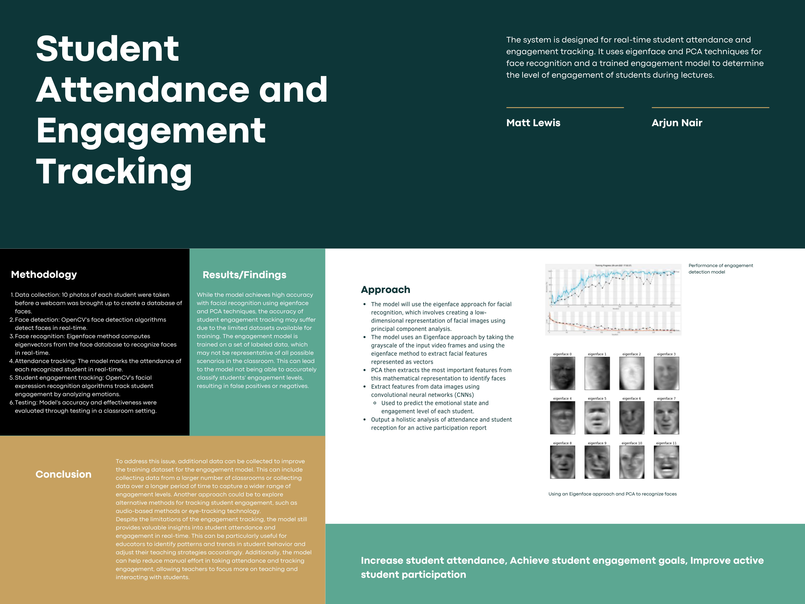

# AI Student Attendance and Engagement Detection

## Description

This project was part of the Neural Networks class, and demonstrated at the Machine Learning Symposium as a Final Project. It uses an Eigenface and PCA approach to detect faces and a pre-trained engagement detection model to determine student engagement and append them to a student engagement report for instructors.


<div style="text-align:center">
    
</div>

</br>

## Dependencies

Install dependencies:
```
$ pip3 install -r requirements.txt
```

## Training the model

The model will take 10 pictures to train itself to a given face.
```
$ py student_attendance/main.py train
```

## Demo of the model

To demo the model after training the model, run the following command:
```
$ py student_attendance/main.py demo
```

## Student Report Generating

The model finaly generates a report for the instructor, containing the students that were present and their engagement percentage for the class period.

 As shown below:

| Person | Attendance | Total Time | Engaged Time | Confused Time | Percentage Engaged | Date       |
|--------|------------|------------|--------------|---------------|-------------------|------------|
| Arjun  | present    | 95         | 70           | 25            | 73.68%            | 2023-04-24 |
